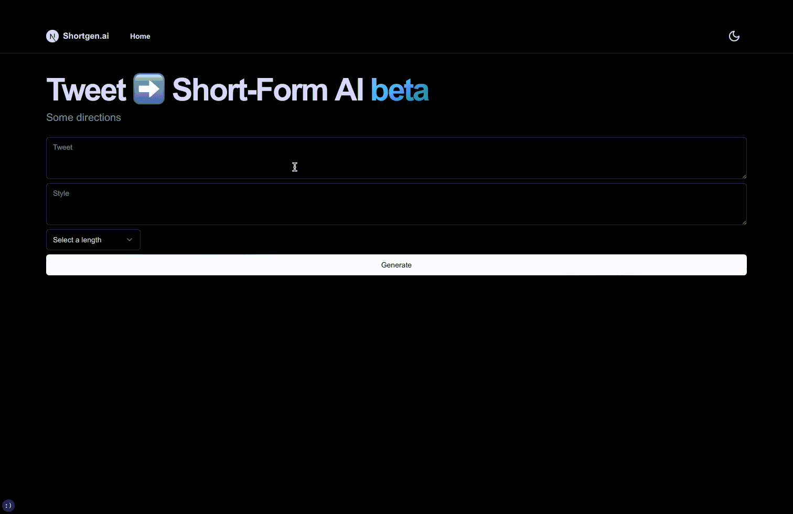

# shortgen.ai
Generate viral short-form content with AI!

## Demo
### 📝 Script generation
- Define your tweet, style, and length
- Generate your script!


### 🖼️ Visual generation
_Coming soon 🔥_

## Configuration
### Environment variables
Your `.env.local` file should look like this:

```bash
channelID=...
serverID=...
SALAI_TOKEN=...
OPENAI_API_KEY=...
SYSTEM_PROMPT=...
```
